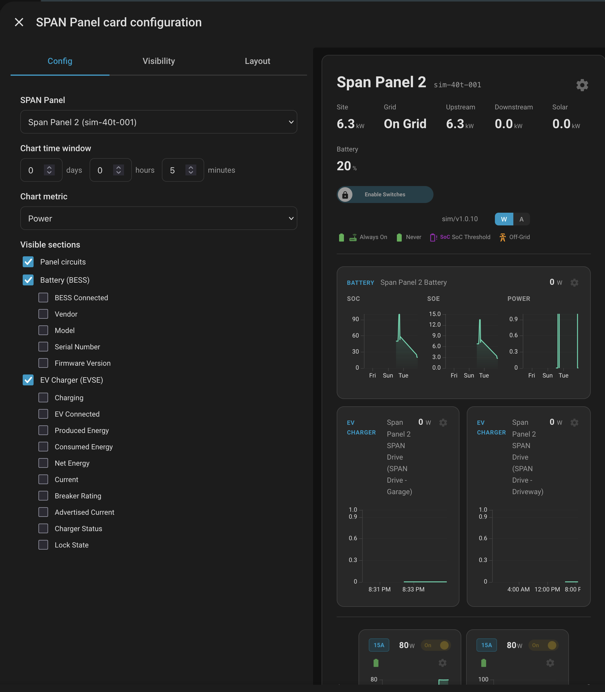

# SPAN Panel Card

A custom Lovelace card for Home Assistant that renders a physical representation of a SPAN electrical panel, showing circuits laid out by their actual tab
positions.



## Features

- Two-column grid matching the physical panel layout (odd tabs left, even tabs right)
- 240V circuits span both columns
- Live power readings with utilization bar
- Breaker rating badges
- Relay on/off status indicators
- Historical power/current charts per circuit
- EVSE and BESS sub-device sections
- Auto-discovers all circuit entities from a single device selection

## Requirements

- [SPAN Panel integration](https://github.com/SpanPanel/span) **v2.0.5 or later** installed and configured
- Circuits must have `tabs` attributes (included in SPAN Panel integration v1.2+)

## Installation

As of SPAN Panel integration **v2.0.5**, this card is automatically registered as a Lovelace resource by the integration itself — no separate installation is
required. The integration serves the card JS from its own static path and writes the resource entry on setup.

> **Migrating from HACS or manual install?** If you previously installed this card via HACS or manually copied `span-panel-card.js` to your `www/` directory,
> you should:
>
> 1. Remove the HACS-managed dashboard resource (HACS > Dashboard > SPAN Panel Card > Remove) — or delete the manual `/local/span-panel-card.js` resource from
>    **Settings > Dashboards > Resources**
> 2. Remove `span-panel-card.js` from your `config/www/` directory if present
> 3. Restart Home Assistant
>
> The integration will register its own copy of the card automatically on next startup.

## Configuration

The card includes a visual editor accessible through the dashboard UI. You can also configure it manually in YAML.

### Minimal Configuration

```yaml
type: custom:span-panel-card
device_id: <your_span_panel_device_id>
```

### Full Configuration

```yaml
type: custom:span-panel-card
device_id: <your_span_panel_device_id>
history_days: 0
history_hours: 0
history_minutes: 5
chart_metric: power
show_panel: true
show_battery: true
show_evse: true
```

### Options

| Option                 | Type    | Default        | Description                                                                       |
| ---------------------- | ------- | -------------- | --------------------------------------------------------------------------------- |
| `device_id`            | string  | **(required)** | The Home Assistant device ID of your SPAN Panel                                   |
| `history_days`         | integer | `0`            | Number of days of history to display in charts (0-30)                             |
| `history_hours`        | integer | `0`            | Number of hours of history to display in charts (0-23)                            |
| `history_minutes`      | integer | `5`            | Number of minutes of history to display in charts (0-59)                          |
| `chart_metric`         | string  | `power`        | Metric to display on circuit charts: `power` or `current`                         |
| `show_panel`           | boolean | `true`         | Show the panel circuits grid                                                      |
| `show_battery`         | boolean | `true`         | Show battery (BESS) sub-device section                                            |
| `show_evse`            | boolean | `true`         | Show EV charger (EVSE) sub-device section                                         |
| `visible_sub_entities` | object  | `{}`           | Map of entity IDs to booleans controlling which sub-device entities are displayed |

### Finding Your Device ID

1. Go to **Settings > Devices & Services**
2. Click your SPAN Panel device
3. The device ID is in the URL: `/config/devices/device/<device_id>`

### History Duration

When `history_days` or `history_hours` are set, `history_minutes` defaults to `0` unless explicitly provided. When neither is set, `history_minutes` defaults to
`5`.

## Data Sources

The card reads the following from the SPAN Panel integration:

| Data               | Source                                     |
| ------------------ | ------------------------------------------ |
| Panel position     | `tabs` attribute on circuit sensors        |
| Power (W)          | Circuit power sensor state                 |
| Breaker rating (A) | Circuit breaker rating sensor state        |
| Relay on/off       | `relay_state` attribute / switch entity    |
| Voltage            | `voltage` attribute (120V or 240V)         |
| Panel size         | `panel_size` attribute on status sensor    |
| EVSE / BESS        | Sub-devices discovered via `via_device_id` |
